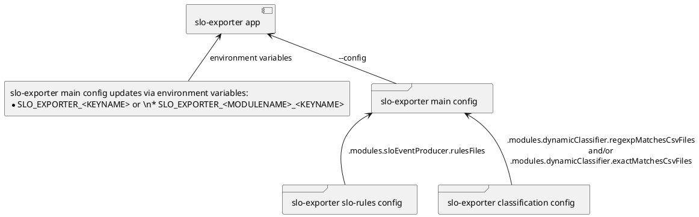

# SLO exporter

[](https://gitlab.seznam.net/Sklik-DevOps/slo-exporter/commits/master)
[](https://gitlab.seznam.net/Sklik-DevOps/slo-exporter/commits/master)


slo-exporter is golang tool used for
 * reading events from different sources (a log file, prometheus metrics)
 * processing the events (filtering, normalization and classification)
 * exporting SLO's SLI (based on the processed events)

slo-exporter is configured via several configuration files and/or environment variables as shown below.



On GitLab pages you can find some Go related stuff
- [GoDoc](https://sklik-devops.gitlab.seznam.net/slo-exporter/godoc/pkg/gitlab.seznam.net/sklik-devops/slo-exporter/)
- [Code coverage](https://sklik-devops.gitlab.seznam.net/slo-exporter/coverage.html)


## Build

It is recommended to build slo-exporter with golang 1.13+.

```bash
make build
```

## Testing on real-time production logs
Requires credentials to log in to szn-logy

Make sure to have `.env` file in the root of this repository in following format
```bash
SZN_LOGY_USER=xxx
SZN_LOGY_PASSWORD=xxx
```

Then just run
```bash
make compose
```

Address:
 - Prometheus scraping slo-exporter metrics: http://localhost:9090
 - slo-exporter address: http://localhost:8080/metrics

**[Use this link to see the graphs](http://localhost:9090/graph?g0.range_input=5m&g0.stacked=1&g0.expr=increase(slo_exporter_tailer_lines_read_total%5B10s%5D)&g0.tab=0&g1.range_input=5m&g1.stacked=1&g1.expr=sum(increase(slo_exporter_dynamic_classifier_events_processed_total%5B10s%5D))%20by%20(result%2C%20classified_by)&g1.tab=0&g2.range_input=1h&g2.expr=&g2.tab=1&g3.range_input=5m&g3.expr=histogram_quantile(0.99%2Crate(slo_exporter_dynamic_classifier_matcher_operation_duration_seconds_bucket%5B10s%5D))&g3.tab=0&g4.range_input=5m&g4.stacked=1&g4.expr=increase(slo_exporter_tailer_malformed_lines_total%5B10s%5D)&g4.tab=0&g5.range_input=5m&g5.stacked=1&g5.expr=histogram_quantile(0.99%2Crate(slo_exporter_slo_event_producer_evaluation_duration_seconds_bucket%5B10s%5D))&g5.tab=0&g6.range_input=5m&g6.stacked=1&g6.expr=increase(slo_exporter_slo_event_producer_events_not_matching_any_rule%5B10s%5D)&g6.tab=0&g7.range_input=15m&g7.stacked=0&g7.expr=slo_exporter_sqlwriter_batch_size&g7.tab=0&g8.range_input=2d&g8.expr=sum(timescale_slo_events_total)%20by%20(result)&g8.tab=0&g9.range_input=5m&g9.stacked=0&g9.expr=increase(slo_exporter_sqlwriter_batch_writes_total%5B10s%5D)&g9.tab=0&g10.range_input=15m&g10.expr=increase(slo_exporter_event_filter_filtered_events_total%5B10s%5D)&g10.tab=0)**


## Architecture diagram
Written in Go using the [pipeline pattern](https://blog.golang.org/pipelines)

```
                                                      static config
                                                        +-------+
                                                        |       |
                                                        |       |
                                                        |       +----------+
                                                        |       |          |
                                                        +-------+          |
                                                                         +-v------+
                                                                         | cache  |            +--------------+
                                                                         |        |            |              |
+--------------+                                                         +-^----+-+            | 70% critical |
| nginx log    |                                                           |    |              | 50% warning  |
| processor    +-------+ event                                             |    |              |              |
|              |       |                                                   |    |              +------+-------+
+--------------+       |                                                   |    |                     |
                       |                                                   |    |                     |         (classified)                 SLO
+--------------+       |   +--------+       +------------+    event    +---+----v---+   event   +-----v-------+    event     +-----------+   event    +----------------+
| envoy log    |       |   | event  |       | event      |             | dynamic    |           | statistical |              | SLO event |            | Prometheus     |
| receiver     +-----------> filter +-------+ normalizer +-------------> classifier +-----------> classifier  +--------------+ producer  +------------> SLO exporter   |
|              |       |   |        |       |            |             |            |           |             |              |           |            |                |
+--------------+       |   +--------+       +------------+             +------------+           +-------------+              +-----------+            +----------------+
                       |
+--------------+       |
| prometheus   |       |
| query        +-------+ event
| processor    |
+--------------+

```

## Frequently asked questions

### How to add new normalization replacement rule?

Event normalization is done in [`event normalizer`](pkg/normalizer/normalizer.go).
User can add normalization replacement rule in slo-exporter main config under key [`.modules.normalizer.replaceRules`](conf/slo_exporter.yaml).

Suppose you see a lot of events matching this regular expression `/api/v1/ppchit/rule/[0-9a-fA-F]{5,16}` which you want to normalize, then your normalization replacement rule can look like following snippet:

```yaml
...
modules:
  normalizer:
    replaceRules:
      - regexp: "/api/v1/ppchit/rule/[0-9a-fA-F]{5,16}"
        # Replacement of the matched path
        replacement: "/api/v1/ppchit/rule/0"
```

### How to deal with malformed lines?

Before !87. If you are seeing too many malformed lines then you should inspect [tailer package](pkg/tailer/tailer.go) and seek for variable `lineParseRegexp`.

After !87, slo-exporter main config supports to specify custom regular expression in field `.module.tailer.loglineParseRegexp`.

### How to deploy slo-exporter?

slo-exporter can be deployed as:
 1. sidecar container application tailing local (emptydir) (proxy) logs
     * manifest example can be found in [userproxy repository](https://gitlab.seznam.net/sklik-frontend/Proxies/tree/master/userproxy/kubernetes)
 1. standalone application tailing remote logs using [`htail` web page tailer over http](https://gitlab.seznam.net/Sklik-DevOps/htail)
     * manifest example can be found in [kubernetes directory](kubernetes/)
